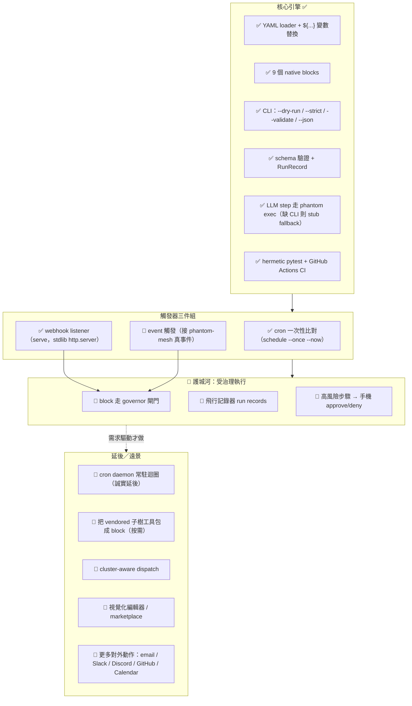

> ARCHIVED 2026-06-19 — 內容已併入 docs/phantom-flow.md;此為歷史版本。

# phantom-flow — 路線圖（繁體中文・視覺化）

> 🌐 本檔是 [`ROADMAP.md`](ROADMAP.md)（英文・狀態 SSOT）的中文視覺化導覽。
> **狀態的唯一真實來源仍是英文 `ROADMAP.md`**；本檔若與其衝突，以英文版為準。
> 選型依據見 [`docs/OSS-LANDSCAPE-AND-DIRECTION.md`](docs/OSS-LANDSCAPE-AND-DIRECTION.md)。
>
> _更新：2026-06-19。_

---

## ① 定位 + 護城河

**一句話**：phantom-flow 是一個**極小、在地優先（local-first）、mesh 原生**的
YAML 工作流跑者（~750 行、近 stdlib、唯一硬依賴 PyYAML）。

**它不是**：n8n / Zapier 的替代品、視覺化編輯器、SaaS、資料管線（ETL）引擎。

**🏰 護城河（別人沒有的交集）**：

> **「受治理（governed）+ 在地 + mesh 原生」的流程** —— 每個有副作用的步驟
> （subprocess / HTTP / 對外動作）都能走 phantom-mesh 的
> **governor + 飛行記錄器 + 手機核可**，跑在你自己的機器上，小到一個人能審完全部。

n8n 比整合數量（400+）—— 我們**不比**那個，比不過也不該比。
我們的價值正好相反：**小、可治理、在地、可審計**。對齊 phantom-mesh apex 的
`④ 安全的無人值守執行` 差異化。

---

## ② 狀態流（Mermaid）

圖例：✅ 已交付（測試覆蓋）　🚧 進行中／部分　📅 規劃中　🔭 遠景／刻意延後

---

## ③ 分期表

排序依**單人多機開發模型**（z13 / M5 / M1 / acer / ayaneo / Android；
寫＝codex/claude，審≥2 個不同 AI，governor + 雙閘 → 手機）：
**便宜高值先、護城河先；需外部整合／操作者決策的後做。**

| 階段 | 目標 | 具體項（2–4，grounded） | 在哪台機 + 哪 AI | 風險／前置 |
|---|---|---|---|---|
| **P1 🏰 鎖護城河** | 讓流程「受治理」 | (a) `pipeline.subprocess`/`tools.http_get`/對外動作 走 governor 閘門；(b) 飛行記錄器 run records；(c) 高風險步驟手機 approve/deny | 寫：z13/M5 codex→claude；審：acer/ayaneo agy + opencode | 前置＝phantom-mesh L1 governor 介面（已存在於主 repo）；風險＝跨 repo 介面對齊 |
| **P2 📅 補齊觸發三件組** | cron ✅ + webhook ✅ + **event** | (a) `trigger.type=event` 消費 mesh 真事件（目前只驗 shape）；(b) 文件化 cron/webhook/event 矩陣 | 寫：M1 codex；審：z13 claude + agy | 前置＝確認 mesh event bus 格式；風險低（在地、stdlib） |
| **P3 🚧 按需包工具** | staged source → 真 block | (a) 挑 2–3 個最常用的 `ai_automation_framework` 工具寫 adapter block（各附測試）；(b) 或 1 個 `data_analysis` block | 寫：acer codex（逐檔）；審：z13 claude + ayaneo opencode | 前置＝**license scrub**（vendored 含他人碼，確認相容 Apache-2.0）；風險＝為包而包→需真 flow 驅動 |
| **P4 🔭 觸及（操作者把關）** | 少數真・對外動作 | (a) email + 一個聊天通道（Telegram/LINE，重用 phantom-mesh notifier）；(b) **僅當有真 flow 需要才做** | 寫：M5 codex；審：≥2 AI；發布前操作者拍板 | 風險＝scope creep；前置＝憑證/金鑰管理走 mesh，勿外洩 |
| **P5 🔭 互通而非克隆**（需求未證實 `[unverified]`） | 與生態系互通 | (a) 接受 n8n/Activepieces 的 inbound webhook；(b) 文件化「從它們呼叫 phantom-flow serve」 | 寫：任一節點 codex；審：claude + agy | 低優先；需操作者確認確有此需求 |

> OSS 選型一律標「**候選方向**」，不直接 vendoring：governor 模式參考
> LangGraph 的 human-in-loop checkpoint；flow/event 模式參考 Node-RED / Huginn；
> adapter（piece）契約參考 Activepieces；durable 語意參考 Trigger.dev / Temporal
> （**只在真有需求時**）。細節見
> [`docs/OSS-LANDSCAPE-AND-DIRECTION.md`](docs/OSS-LANDSCAPE-AND-DIRECTION.md)。

---

## ④ 刻意不做 / over-build 警戒

| ❌ 不做 | 為什麼 | 改採 |
|---|---|---|
| 🚫 重建 n8n / 視覺化編輯器 / marketplace | 400+ 整合＋拋光 UI 是多年多人團隊的成果，單人比不過也不該比 | 互通（收 webhook、被它們呼叫）而非克隆 |
| 🚫 一次把 10 萬行 vendored 子樹全接上湊「工具數」 | 每個 wrap 都是維護＋授權掃描負債 | 按需 wrap，由真 flow 驅動，逐個附測試 |
| 🚫 提早做常駐 server / daemon / UI | `serve` + `schedule --once` + 外部排程器（launchd/systemd/mesh）已覆蓋真實 cron+webhook 需求 | daemon 迴圈誠實延後，需要時再做 |
| 🚫 追 durable execution（Temporal / Trigger.dev 級） | 那是「大規模長任務扛崩潰」的問題，單人在地工具沒有 | 只在真有 flow 需要時，採其**語意**不採其重量 |
| 🚫 漂進資料管線（Airflow/Dagster/Prefect）地盤 | 那是 ETL／DAG，使用者不同 | 守住「個人・受治理工作流」這個利基 |
| 🚫 隨意加重依賴 | 「只依賴 PyYAML」本身就是護城河（可審計、無依賴地獄） | 加重依賴的 PR 必須對「可審計性」負舉證責任 |

---

_排序原則回顧：cheap+high-value 先、moat（受治理）先、需外部整合/操作者決策後。
狀態以 [`ROADMAP.md`](ROADMAP.md) 為準；選型理據見
[`docs/OSS-LANDSCAPE-AND-DIRECTION.md`](docs/OSS-LANDSCAPE-AND-DIRECTION.md)。_
