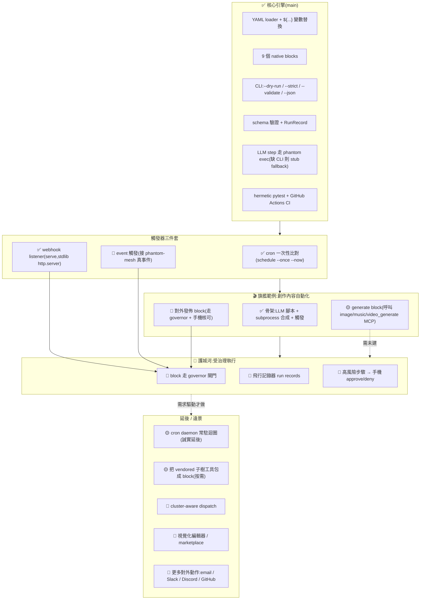

# phantom-flow — 唯一主文件

> 本檔為 phantom-flow 唯一主文件;英文狀態細節與舊版見 `docs/_archive/`。
> 對應狀態:`main` @ `8b4adb4` — hermetic pytest 綠、9 個 native blocks、CLI(`--dry-run`/`--strict`/`--validate`/`--json`)、三件套觸發器中 cron(`--once`)+webhook(`serve`)已出貨、event 待建。每個「已出貨」項都對應 `main` 上的真實 commit。

## 目錄
- [這是什麼](#這是什麼)
- [旗艦範例:創作內容自動化](#旗艦範例創作內容自動化)
- [怎麼運作](#怎麼運作)
- [快速上手](#快速上手)
- [狀態與視覺路線圖](#狀態與視覺路線圖)
- [開源生態與方向](#開源生態與方向)
- [刻意不做 / over-build 風險](#刻意不做--over-build-風險)
- [授權](#授權)

---

## 這是什麼

**一句話:phantom-flow 是一個本機跑、受治理的工作流引擎。**

你把一條工作流寫成一個 YAML 檔(一個觸發器 + 一串步驟),它就照著跑。引擎很小:用幾乎純標準函式庫的 Python 寫成(`phantom_flow/`,約 750+ 行),唯一硬性相依是 PyYAML。它屬於 phantom-mesh 生態系的一部分。

三個關鍵字:

- **本機優先(local-first)** —— 跑在你自己的機器上,不是別人的雲。
- **mesh-native** —— 需要 LLM 或生成能力時,經 phantom-mesh 的 `phantom` CLI 路由(`phantom` 不在時退回一個決定性的 stub,讓測試可離線跑)。
- **受治理(governed)** —— 這是護城河。每一個副作用(跑指令、發 HTTP、對外發佈)都能經 phantom-mesh 的 **governor + 飛行記錄器 + 手機核可** 路由:高風險步驟先暫停,你在手機上按 approve / deny 才繼續。對齊 phantom-mesh apex 的 `④ 安全的無人值守執行`。

**它不是**:n8n / Zapier 的替代品、視覺化編輯器、SaaS、資料管線(ETL)引擎,也不是「600+ 整合」那種東西。我們的價值正好相反:小巧、可治理、本地、可稽核(只依賴 PyYAML 本身就是一項特性)。

---

## 旗艦範例:創作內容自動化

**phantom-flow 最能展示自己的地方,就是把一條條「創作產線」自動化、受治理、在本機跑。**

想法很直接:創作內容(影片、文宣、配樂、貼文、小說、漫畫)本來就是一串固定步驟 —— 想題目、生文字、配圖、配樂、合成、發佈。把這串步驟寫成一條 flow,phantom-flow 就能一鍵跑完;而「對外發佈」這種有後果的步驟,走 governor + 手機核可,不會在你睡覺時亂發東西。

### ⚠️ 先講清楚:哪些今天能跑、哪些是範例方向

老實說很重要,別灌水:

- **引擎本身今天就是真的** —— YAML runner、9 個內建 block、webhook(`serve`)、cron(`schedule`)、schema 驗證、LLM 步驟經 `phantom exec`。這些有 hermetic pytest + CI 撐著(見〈狀態與視覺路線圖〉)。
- **底下這六條創作 flow 是「範例 / 方向」,不是今天已出貨的產品。** 它們示範「這類產線怎麼用 phantom-flow 串」。每條 flow 我都標清楚:哪些步驟用**已出貨的 block**,哪些步驟**需要一個尚未建的 block**。
- 最關鍵的缺口:**圖 / 樂 / 影的生成**。phantom-mesh 確實有 `image_generate` / `music_generate` / `video_generate` 這些 MCP 工具,但 phantom-flow **還沒有一個 block 去呼叫它們**。所以每條創作 flow 都需要一個規劃中的「生成 block」(暫稱 `pipeline.mcp` 或 `pipeline.generate`,把步驟轉成一次 phantom-mesh MCP 工具呼叫)。**這個 block 今天還沒建。** 在它建好之前,這些 flow 的生成步驟只能用 `--dry-run` 規劃,不能真的產出素材。

> 對照表:每條 flow 需要的「生成步驟」都標 🟡(需未建的 `generate` block)或 🔴(連工具都還沒接)。文字步驟(LLM)、條件、發佈到 log/stdout、webhook/cron 觸發、`subprocess` 合成 —— 這些都是 ✅ 已出貨的 block。

### 1. 影片生成自動化 🟡

**做什麼:** 給一個主題,自動產出一支短片 —— 腳本(LLM)→ 旁白(TTS)→ 配樂(`music_generate`)→ 畫面素材(`image_generate` / `video_generate`)→ 用 ffmpeg 合成 → 輸出檔案。

```yaml
name: video-from-topic
version: 1
trigger:
  type: manual
pipeline:
  - id: script                       # ✅ 已出貨 block(llm_summarize / LLM 步驟)
    block: pipeline.llm_summarize
    input: "主題:在地咖啡店的一日"
    prompt: "寫一支 30 秒短片腳本,分 4 個鏡頭,每鏡一句旁白。"
  - id: narration                    # 🟡 需未建 generate block(TTS,走 phantom-mesh)
    block: pipeline.generate
    tool: tts
    input: "${script.summary}"
  - id: music                        # 🟡 需未建 generate block(music_generate)
    block: pipeline.generate
    tool: music_generate
    input: "輕快、咖啡店氛圍、30 秒"
  - id: visuals                      # 🟡 需未建 generate block(image/video_generate)
    block: pipeline.generate
    tool: image_generate
    input: "${script.summary}"       # 每個鏡頭一張圖
  - id: compose                      # ✅ 已出貨 block(subprocess + ffmpeg)
    block: pipeline.subprocess
    cmd: "ffmpeg -i visuals/*.png -i narration.wav -i music.wav out.mp4"
outbound:
  - block: actions.stdout            # ✅ 已出貨 block
    line: "影片完成:out.mp4"
```

**已出貨:** 腳本(LLM)、合成(`subprocess` + ffmpeg)、輸出(`stdout`)。
**需未建 block:** 旁白(TTS)、配樂(`music_generate`)、畫面(`image_generate` / `video_generate`)—— 全部走規劃中的 `generate` block。

### 2. 文宣 / 行銷文案 🟡

**做什麼:** 給一個主題,LLM 生成多版文案,各自配一張圖,再排版輸出。

```yaml
name: marketing-copy
version: 1
trigger:
  type: manual
pipeline:
  - id: copies                       # ✅ LLM 步驟,生 3 版文案
    block: pipeline.llm_summarize
    input: "新品:手沖咖啡濾杯"
    prompt: "寫 3 版社群行銷短文,風格各異,各 50 字內。"
  - id: images                       # 🟡 需未建 generate block(image_generate)
    block: pipeline.generate
    tool: image_generate
    input: "${copies.summary}"
  - id: layout                       # ✅ subprocess 排版(如 imagemagick)
    block: pipeline.subprocess
    cmd: "montage copy-*.txt image-*.png poster.png"
outbound:
  - block: actions.log_append        # ✅ 已出貨 block
    path: "~/marketing/${date.today}.log"
    line: "產出 3 版文宣 + 配圖"
```

**已出貨:** 文案(LLM)、排版(`subprocess`)、紀錄(`log_append`)。
**需未建 block:** 配圖(`image_generate`)。

### 3. 配樂 🟡

**做什麼:** 給情境 / 節奏,用 `music_generate` 產出多段,挑選後輸出。

```yaml
name: bgm-generator
version: 1
trigger:
  type: manual
pipeline:
  - id: tracks                       # 🟡 需未建 generate block(music_generate × N)
    block: pipeline.generate
    tool: music_generate
    input: "情境:專注工作;節奏:中速 lo-fi;產 4 段各 60 秒"
  - id: pick                         # ✅ 已出貨 block(if 條件挑選)
    block: pipeline.if
    condition: "${tracks.count} > 0"
outbound:
  - block: actions.stdout            # ✅ 已出貨 block
    when: "${pick.true}"
    line: "配樂候選已產出,待挑選"
```

**已出貨:** 挑選(`if`)、輸出(`stdout`)。
**需未建 block:** 多段配樂生成(`music_generate`)。

### 4. 社群處理 🟡(發佈走 governor + 手機核可)

**做什麼:** 監聽(webhook / cron)→ 生成貼文(+ 配圖)→ 排程發佈 + 互動回覆。**對外發佈是高風險步驟,經 governor 暫停,手機核可才發。**

```yaml
name: social-autopost
version: 1
trigger:
  type: webhook                      # ✅ 已出貨(serve listener)
  url: "/hooks/social-trigger"
pipeline:
  - id: post                         # ✅ LLM 步驟,生貼文
    block: pipeline.llm_summarize
    input: "${event.body}"
    prompt: "根據這則事件,寫一則社群貼文,200 字內。"
  - id: image                        # 🟡 需未建 generate block(image_generate)
    block: pipeline.generate
    tool: image_generate
    input: "${post.summary}"
outbound:
  - block: actions.publish           # 🔴 需未建發佈 block + 必走 governor 閘門
    governed: true                   #     高風險:對外發佈 → 手機 approve/deny
    channel: "social"
    text: "${post.summary}"
```

**已出貨:** 監聽(`webhook` / `serve`)、生貼文(LLM)。
**需未建 block:** 配圖(`image_generate`);對外**發佈 block**(且必須走 governor 閘門 + 手機核可,這正是護城河)。
**注意:** 排程發佈用 cron 觸發;互動回覆是另一條 webhook flow。

### 5. 小說生成 🟡

**做什麼:** 設定 / 大綱 → 分章 LLM 續寫 → 角色 / 場景配圖 → 組裝成章節。

```yaml
name: novel-writer
version: 1
trigger:
  type: manual
pipeline:
  - id: outline                      # ✅ LLM 步驟,生大綱
    block: pipeline.llm_summarize
    input: "設定:賽博龐克偵探,10 章"
    prompt: "產出 10 章大綱,每章一句。"
  - id: chapter                      # ✅ LLM 步驟,逐章續寫(迴圈由外層驅動)
    block: pipeline.llm_summarize
    input: "${outline.summary}"
    prompt: "依大綱續寫第 N 章,約 2000 字。"
  - id: scene_art                    # 🟡 需未建 generate block(image_generate)
    block: pipeline.generate
    tool: image_generate
    input: "${chapter.summary}"      # 場景 / 角色配圖
  - id: assemble                     # ✅ 已出貨 block(subprocess 組裝)
    block: pipeline.subprocess
    cmd: "pandoc chapter-*.md -o novel.epub"
outbound:
  - block: actions.stdout            # ✅ 已出貨 block
    line: "小說組裝完成:novel.epub"
```

**已出貨:** 大綱與分章續寫(LLM)、組裝(`subprocess` + pandoc)、輸出(`stdout`)。
**需未建 block:** 場景 / 角色配圖(`image_generate`)。

### 6. 漫畫生成 🟡

**做什麼:** 劇本 → 分鏡 → 各格 `image_generate` → 拼版 + 加對白。

```yaml
name: comic-generator
version: 1
trigger:
  type: manual
pipeline:
  - id: script                       # ✅ LLM 步驟,生劇本
    block: pipeline.llm_summarize
    input: "主題:機器人想養貓"
    prompt: "寫一頁 4 格漫畫劇本,每格描述畫面 + 對白。"
  - id: panels                       # 🟡 需未建 generate block(image_generate × 4)
    block: pipeline.generate
    tool: image_generate
    input: "${script.summary}"       # 每格一張圖
  - id: compose                      # ✅ 已出貨 block(subprocess 拼版 + 對白)
    block: pipeline.subprocess
    cmd: "montage panel-*.png -tile 2x2 page.png && add-bubbles page.png"
outbound:
  - block: actions.stdout            # ✅ 已出貨 block
    line: "漫畫頁完成:page.png"
```

**已出貨:** 劇本(LLM)、拼版 + 對白(`subprocess`)、輸出(`stdout`)。
**需未建 block:** 各格畫面(`image_generate`)。

### 小結:這些範例告訴我們什麼

這六條 flow 的「骨架」—— 觸發、串步驟、條件、LLM、合成、發佈紀錄 —— **今天的引擎就能跑**。卡住的只有一塊:**呼叫 phantom-mesh 生成工具的 `generate` block 還沒建**。一旦補上那個 block(把 `image_generate` / `music_generate` / `video_generate` / TTS 包成一層薄 `fn(spec, ctx)` 轉接,經 `phantom` MCP 路由),這些創作產線就能真的端到端跑;而對外發佈那一步,走 governor + 手機核可 —— 這就是 phantom-flow 跟「又一個 workflow 引擎」的差別。

---

## 怎麼運作

### Flow 形狀(YAML)

一條 flow = 一個觸發器 + 一串具名步驟(pipeline)+ 選用的對外動作(outbound)。

```yaml
name: my-flow
version: 1
trigger:
  type: cron        # cron | webhook | event | manual(僅驗證形狀;
  schedule: "0 9 * * *"   #   cron/manual 是你會手動跑的)
pipeline:
  - id: fetch
    block: tools.http_get
    url: "https://example.com"        # 或 file:// 供離線執行
  - id: count
    block: pipeline.regex_count
    input: "${fetch.body}"
    pattern: "AI"
  - id: gate
    block: pipeline.if
    condition: "${count.value} > 0"
  - id: summary
    block: pipeline.llm_summarize
    input: "${fetch.body}"
outbound:
  - block: actions.stdout
    when: "${gate.true}"              # 選用的閘門
    line: "hits=${count.value} summary=${summary.summary}"
```

`${...}` 解析 `step.field`、`date.today`、`date.now`、`env.X`。

### 內建 block(9 個,全部已出貨)

| Block | 功能 |
|-------|------|
| `tools.http_get` | GET 一個 URL(`http(s)://` 或 `file://`);回傳 status/body/body_len |
| `tools.youtube_transcript` | 抓取字幕(選用相依;有 cached-sample 後備) |
| `pipeline.regex_count` | 計算文字中 regex 命中數 |
| `pipeline.filter` | 保留文字中出現的關鍵字 |
| `pipeline.if` | `>` / `<` / `==` 條件 → `{true,false}` |
| `pipeline.llm_summarize` | 經 phantom LLM driver 摘要(stub 後備) |
| `pipeline.subprocess` | 跑一個命令(bounded timeout、捕捉 stdout/stderr) |
| `actions.log_append` | 把一行附加到檔案 |
| `actions.stdout` | 印出一行 |

要加自己的 block,在 `phantom_flow.runner.BLOCK_REGISTRY` 註冊一個 `fn(spec, ctx) -> dict`。**上面創作範例用到的 `pipeline.generate`(呼叫 phantom-mesh 圖/樂/影生成工具)就是用這個機制將來要加的一個 block —— 今天還沒在 registry 裡。**

### 觸發器三件套

- **cron(單次、hermetic)** —— `phantom-flow schedule <flow> --once [--now ISO]`。`schedule_matches(expr, dt)` 是純標準函式庫的 5 欄位匹配器(`*`、清單、範圍、`*/n`;不用 croniter)。到期則跑 flow,否則印 "not due"。時間經 `--now` 注入(不需真實時鐘)。
- **webhook** —— `phantom-flow serve <flow>` 啟動一個標準函式庫 `http.server` listener;對 flow 的 `trigger.url` 發出 POST 會植入 `ctx["event"]` 並驅動既有的 `run_flow`(200+RunRecord / 404 未對應 / 500+partial)。純標準函式庫(無 fastapi/uvicorn)。
- **event** —— 📅 尚未建置(`trigger.type=event` 目前只驗證形狀)。

---

## 快速上手

### 安裝

```bash
git clone https://github.com/markl-a/phantom-flow
cd phantom-flow
pip install -r requirements.txt        # 只有 PyYAML
# 選用:pip install -e ".[youtube]" # 加上 youtube_transcript_api
```

### Quickstart

```bash
# Lint 一條 flow:驗證 schema + 檢查每個 block 名稱,不碰網路/LLM。
python -m phantom_flow.runner flows/jobseek-daily.yaml --dry-run --strict --validate

# 端到端跑一個完全離線的範例(file:// 抓取 + stub LLM):
PHANTOM_FLOW_SAMPLE="file:///$(pwd)/flows/samples/ai-jobs-sample.txt" \
PHANTOM_FLOW_STUB_LLM=1 \
  python -m phantom_flow.runner flows/examples/local-text-summary.yaml --json
```

`PHANTOM_FLOW_STUB_LLM=1` 強制使用決定性的 stub LLM,使執行 hermetic(密封)。若不設它(且 PATH 上有 `phantom` CLI),`llm_summarize` block 會把 prompt 經由 `phantom exec` 路由。

### 隨附 flows

- `flows/examples/local-text-summary.yaml`、`flows/examples/keyword-report.yaml` —— **完全離線**,以 stub LLM 端到端跑完(CI 已測)。
- `flows/jobseek-daily.yaml` —— 真實的 cron-shaped flow,爬一個公開職缺頁;真跑需網路(dry-run/lint 離線)。
- `flows/youtube-summarize.yaml` —— 字幕 → 摘要;需選用的 `youtube` extra(或用隨附的 cached transcript)。
- `flows/example-webhook.yaml` —— webhook 觸發的 flow;跑 `phantom-flow serve flows/example-webhook.yaml` 啟動 listener,再 POST 到其 `trigger.url`。

> 上面〈旗艦範例〉那六條創作 flow 是**展示方向**,不在隨附 flows 裡跑(它們需要尚未建的 `generate` block)。

### 測試

Hermetic 且離線 —— 無網路、無真實 LLM(`PHANTOM_FLOW_STUB_LLM=1` 走 stub)、不在 `tmp_path` 外寫入。

```bash
python -m pytest -ra -q
```

---

## 狀態與視覺路線圖

> 排序原則:① **便宜高值優先** ② **護城河(受治理)優先於廣度** ③ 需外部整合/操作者決策的**排後並標明** ④ 明列**刻意不做**。
> 每個「已出貨」項對應 `main` 上的真實 commit;一個能力**只有在實作完成且具測試覆蓋**後,才從〈規劃中〉升上〈已出貨〉。階段的**具體選型**(governor 介面、Node-RED/Activepieces/LangGraph 等)屬下方〈開源生態與方向〉的**建議路線**(候選方向),非已鎖定承諾。

### 狀態總覽(Mermaid)



> 圖例:✅ 已出貨(測試覆蓋)｜ 🟡 進行中/部分/已備源碼未接線 ｜ 🔴 規劃中(他處宣稱但未建)｜ 🔭 願景/刻意延後 ｜ 🏰 護城河 ｜ 🎬 創作範例 ｜ ⚠️ over-build 警戒

### ✅ 已出貨(grounded,對應真實 commit)

已出貨的引擎是一個小型、local-first 的 YAML 工作流執行器(`phantom_flow/`,約 750+ 行,近乎純標準函式庫,唯一硬相依 PyYAML)。

| 項目 | 具體內容 | 對應 commit / 證據 |
|---|---|---|
| YAML loader + 替換 | YAML 載入器、`${...}` 替換(`step.field`/`date.today`/`date.now`/`env.X`) | 引擎本體 `runner.py` |
| 9 個 native blocks | `http_get`(含 `file://`)、`youtube_transcript`、`regex_count`、`filter`、`if`、`llm_summarize`、`subprocess`、`log_append`、`stdout` | `runner.py` `BLOCK_REGISTRY` |
| CLI + schema + run records | `--dry-run`/`--strict`(registry lint)/`--validate`(schema)/`--json`;`validate_flow` + 結構化 `RunRecord` | `1b4c9b8` |
| LLM driver | 經 `phantom exec` 路由 + 決定性 stub 後備;`force_stub`/`timeout`/`model_hint` 接入生產 `llm_summarize` 路徑,降級原因被顯示 | `8b481c2` `a042870` |
| subprocess 邊界硬化 | bounded timeout、stderr capture、後備;`http_get` `max_bytes` null/0 收斂為 bounded default | `5af105f` `2284eea` `c2602a4` |
| webhook listener | `phantom-flow serve <flow>`(stdlib `http.server`);POST 到 `trigger.url` 植入 `ctx["event"]` 驅動 `run_flow`。把 `trigger.type=webhook` 從宣告變成真實 POST 觸發 | `f9de0d5` `b9f3315` |
| cron scheduler(單次) | `schedule_matches(expr, dt)` 純 stdlib 5 欄位匹配器;`phantom-flow schedule <flow> --once [--now ISO]`;時間經 `--now` 注入 | `ad4c12d` `7975a36` |
| 離線範例 flows | `flows/examples/local-text-summary.yaml` + `keyword-report.yaml`,以 stub LLM 端到端跑完 | `654e464` |
| hermetic 測試 + CI | runner/llm_driver/schema/examples/packaging;無網路、無真實 LLM、不在 `tmp_path` 外寫;GitHub Actions `ci.yml` | `2f131b3` `20cebee` |

> 目前:hermetic pytest 套件全綠、9 個 native blocks、三件套觸發器中 cron+webhook 已出貨。原始碼已驗對得上(`runner.py`/`llm_driver.py` 皆在;尚無 event-bus 接點、governor 閘門、cluster dispatch)。**上面〈旗艦範例〉的創作 flow 所需的 `generate` block 與對外發佈 block,皆尚未在此表 —— 它們是範例方向,不是已出貨。**

### 🟡 進行中(部分 / 已備源碼未接線)

| 目標 | 具體項 | 風險 / 前置 |
|---|---|---|
| 創作生成 block(`generate`) | 上面六條創作 flow 的圖/樂/影/TTS 步驟所需:一層薄 `fn(spec, ctx)` 轉接,把步驟轉成一次 phantom-mesh MCP 工具呼叫(`image_generate` / `music_generate` / `video_generate`)。MCP 工具在 phantom-mesh 那邊已存在,**phantom-flow 這邊的 block 尚未建** | 前置=確認 MCP 工具呼叫介面;按需建,優先讓一條創作 flow 端到端跑通 |
| cron daemon 常駐迴圈 | `--once` 匹配器已出貨,但長時 sleep-loop daemon 誠實延後(`schedule` 子指令印 "daemon loop is not implemented")。今日由外部排程器(launchd/systemd/phantom-mesh)呼叫單次執行器 | 低。需求驅動才做 |
| 包裝 vendored 子樹 | `ai_automation_framework/`(自動化工具、RAG)與 `data_analysis/`(聚類、RFM/CLV)為**已備源碼**(staged source),**引擎不 import**。「30+ 工具」是*目標*非已出貨數;每個工具需先寫一層薄 `fn(spec, ctx)` adapter block 才算數 | 需 license scrub(含他人碼,確認相容 Apache-2.0);按需包裝,勿為包而包 |

### 🏰 P1 — 鎖住護城河(受治理執行,最高價值)

| 目標 | 具體項 | 在哪做 + 哪 AI | 風險 / 前置 |
|---|---|---|---|
| Governor 把關的 block | 將 `pipeline.subprocess` + `tools.http_get` + 對外動作(含創作範例的**發佈 block**)路由經 phantom-mesh **governor 閘門**;flight-recorder 執行記錄;高風險步驟手機 approve/deny。*§開源生態 中沒有任何專案具備此能力* | 寫:orchestrator node (Win)/a Mac node codex→claude;審:Win node A/B agy + opencode | 前置=phantom-mesh L1 governor 介面(已存在於主 repo);風險=跨 repo 介面對齊 |

### 🔴 規劃中(他處宣稱,NOT built)

| 目標 | 具體項 | 在哪做 + 哪 AI | 風險 / 前置 |
|---|---|---|---|
| 對外發佈 block | 創作範例(社群)需要的對外發佈(社群平台/聊天通道);**必須走 governor 閘門 + 手機核可**。今日只有 `log_append`、`stdout` | 寫:a Mac node codex;審:≥2 AI;發布前操作者拍板 | 風險=scope creep + 憑證外洩;憑證走 mesh |
| 補齊觸發三件套 | `trigger.type=event` 消費真實 mesh 事件(目前只驗形狀);撰寫 cron/webhook/event 矩陣文件 | 寫:a Mac node codex;審:orchestrator node (Win) claude + agy | 前置=確認 mesh event bus 格式;風險低(本地、stdlib) |
| cluster-aware dispatch | 把重的 block/flow(如影片合成)送到特定 mesh node(GPU box / always-on Pi / 手機)。早期文件曾把「cluster-aware」當差異化吹,實未實作 | — | 🔭 願景;需求驅動 |
| FTS5 memory 後端 | 把 run records / context 接入 phantom-mesh 記憶 | — | 🔭 願景 |
| 視覺化編輯器 / marketplace | n8n-style 編輯器、premium templates。未起步 | — | 🔭 願景;見〈刻意不做〉 |
| 更多對外動作 | email / Slack / Discord / GitHub / Calendar。今日只有 `log_append`、`stdout` | 寫:a Mac node codex;審:≥2 AI;發布前操作者拍板 | 風險=scope creep;憑證走 mesh 勿外洩 |

### 明確尚未建置

創作範例所需的 **`generate` block**(呼叫 phantom-mesh 圖/樂/影/TTS 生成工具)與**對外發佈 block**;任何 **event-driven mesh 觸發器**(`trigger.type=event` 僅驗形狀)、**cluster-aware dispatch**、daemon 式 **sleep-loop 排程器**、**視覺化編輯器**、**市集**,以及對 vendored `ai_automation_framework/` + `data_analysis/` 子樹的任何接線(已備源碼,**尚未 import**)。

---

## 開源生態與方向

> 領域掃描:**workflow automation / event-driven / cron+webhook 編排**。研究編纂於 2026-06-19。目的:把 phantom-flow 定位於現有主流方案之中,以便採用/包裝/參考正確對象,而*不要*重新打造 n8n。Star 數每日浮動 —— 視為數量級而非精確值;彼此衝突或無法重新查證的數字標 `[unverified]`。本節為決策輔助,非規格書 —— 專案狀態以上方〈狀態與視覺路線圖〉為準。

**核心論點:護城河*不是*「又一個 workflow 引擎」,而是沒有人佔據的那個交集 —— 受治理、local-first、mesh-native 的 flows(每個副作用都能經 governor + flight-recorder + 手機核可路由,跑在你自己的機器,小到一人能稽核全部)。在資料/工具/觸達邊緣*採用或包裝*開源,不在核心重寫;LLM 與生成路徑*唯一*經 phantom-mesh。**

### 判定標籤

`BUILD`(自己做,這是利基)· `WRAP`(包在現有事物之上的轉接層)· `REFERENCE`(借其概念/UX,不要依賴)· `AVOID`(不在賽道內)。

### 2.1 視覺化 / no-code 自動化平台(「n8n 級別」)

最常被拿來*比較*、最容易被要求去「追趕」的專案。它們是龐大的多年期團隊。

| 專案 | URL | Stars | 語言 | 授權 | 成熟度 | 契合度 / 落差 |
|---|---|---|---|---|---|---|
| **n8n** | github.com/n8n-io/n8n | ~193k `[unverified]`(彙整型 blog 仍引 ~60–70k,落差極大) | TypeScript | Sustainable Use License(fair-code,**非 OSI**) | 非常成熟,400+ 整合 | 業界主流但笨重、未受治理、不具 mesh 意識。**不要重建。** 參考其 block/trigger UX;可選 webhook 互通。 |
| **Activepieces** | github.com/activepieces/activepieces | ~23k | TypeScript | MIT(+部分 EE) | 成熟,~280+ pieces | 寬鬆授權、MCP 前瞻。最「友善」的主流方案。**REFERENCE** 其 piece 模型;不值得克隆。 |
| **Node-RED** | github.com/node-red/node-red | ~21k `[unverified]` | JavaScript | Apache-2.0 | 非常成熟(OpenJS),IoT/event 取向 | 真正 event-driven + flow-based + 道地開源。*哲學*上最近的近親。**重點 REFERENCE** 其 flow/event 模型。 |
| **Huginn** | github.com/huginn/huginn | ~42k `[unverified]` | Ruby | MIT | 成熟,web 監測/agent-event | agent-and-event 模型,與我們同類*使用者*(一個人、自己的機器)。Ruby/Rails 是落差。**REFERENCE** 其 agent-emits-event 模式。 |
| **Dify** | github.com/langgenius/dify | ~60k+ `[unverified]` | Python/TS | Modified Apache-2.0 | 成熟,LLM-app + agentic workflow | 伺服器+UI 偏重,是產品非函式庫。**僅供 REFERENCE。** |
| **Flowise** | github.com/FlowiseAI/Flowise | ~30k+ `[unverified]` | TypeScript | Apache-2.0 | 成熟,視覺化 LLM/agent 建構器 | 視覺化拖拉式 LLM 鏈。若哪天想做視覺化編輯器,動工前先 **REFERENCE**。 |

### 2.2 開發者優先 / 程式碼編排

| 專案 | URL | Stars | 語言 | 授權 | 契合度 / 落差 |
|---|---|---|---|---|---|
| **Windmill** | github.com/windmill-labs/windmill | ~16.8k | Rust(+TS) | AGPL-3.0(EE 專有) | script→workflow + Git + 自動 UI;**Rust 核心** 同 phantom-mesh,AGPL 對齊。伺服器偏重。**REFERENCE** 其 hermetic-script + 版本控管。 |
| **Trigger.dev** | github.com/triggerdotdev/trigger.dev | ~13.6k | TypeScript | Apache-2.0 | TS 耐久長任務(retries/queues/observability)。解決我們明確*延後*的「長任務存活過重啟」。若將來需要,**REFERENCE** 其 durable-task 語意。 |
| **Temporal** | github.com/temporalio/temporal | ~16.4k `[unverified]` | Go | MIT | 耐久執行引擎,笨重(伺服器+workers+自有 SDK)。對單人本地工具**嚴重過度設計**。僅 **REFERENCE** 其概念。 |

### 2.3 資料管線編排器(相鄰但**非我們的賽道**)

刻意不踏進 —— 這些是 DAG/ETL 工具,原始 spec 早已宣告**不做**(「不取代 Apache Airflow」)。

| 專案 | URL | 語言 | 授權 | 備註 |
|---|---|---|---|---|
| **Apache Airflow** | github.com/apache/airflow | Python | Apache-2.0 | DAG/ETL 排程器。不同問題(資料管線 vs 個別工作流)。`AVOID` |
| **Dagster** | github.com/dagster-io/dagster | Python | Apache-2.0 | 以 asset 為中心。相鄰,但非我們的使用者。`AVOID` |
| **Prefect** | github.com/PrefectHQ/prefect | Python | Apache-2.0 | Python 原生管線編排。相鄰,但非我們的使用者。`AVOID` |

### 2.4 AI-agent 工作流建構器(在「LLM 區塊」上重疊)

| 專案 | URL | Stars | 語言 | 授權 | 契合度 / 落差 |
|---|---|---|---|---|---|
| **LangGraph** | github.com/langchain-ai/langgraph | ~90k+ `[unverified]` | Python | MIT | 以圖為基礎的 agent runtime(routing、human-in-loop、checkpoints)。是函式庫非產品。**REFERENCE** 其「human-in-loop checkpoint」—— 直接對應 phantom-mesh 的 governor + 手機核可。 |

### 建議方向 / 分階段路徑(務實、單兵尺度)

依單人多機開發模式排序:**便宜 + 高價值 + 護城河優先**,外部整合/需操作者決策者殿後。

- **BUILD(真正屬於我們、護城河):** ① **Governor 把關的 block** —— 來自 phantom-mesh apex 的 `④ safe-unattended` 差異化,風險步驟暫停待手機 approve/deny;*生態裡沒有任何專案具備此能力*,最高價值、最具防禦性(也正是創作範例「社群發佈」那一步的關鍵)。② **創作生成 `generate` block** —— 把 phantom-mesh 的 `image_generate` / `music_generate` / `video_generate` / TTS 包成薄轉接,讓〈旗艦範例〉那六條創作產線端到端跑通(這是 demo 的賣點)。③ **`trigger.type=event` 對接真實 mesh 事件** —— 補齊 cron+webhook+event 三件套,便宜本地高契合。④ **維持近乎純標準函式庫 + hermetic** —— 小體積*本身就是*特性,加重相依視為退步。
- **WRAP(包裝而非自己寫):** ⑤ **生成與 LLM 步驟**皆 WRAP phantom-mesh(`phantom exec` / MCP 工具),保留為*唯一* LLM/生成路徑,不 vendor LangChain/Dify 式技術棧。⑥ **Vendored 子樹工具**(`ai_automation_framework/`、`data_analysis/`)各自於需要時藏在薄 `fn(spec, ctx)` 轉接 block 之後,不要批次 import;每個工具包裝+測試完成前不宣稱「30+ 工具」。
- **REFERENCE(複製 UX/語意,拒絕相依):** Node-RED / Huginn 的 *flow-of-blocks* 與 *agent-emits-event*;Activepieces 的 piece(具型別轉接器)形狀;LangGraph 的 human-in-loop checkpoint → 對應 governor;Trigger.dev / Temporal 的 durable-execution *語意*(僅在某 flow 確實需要存活過重啟時)。
- **AVOID:** 重建 n8n / 視覺化編輯器 / 市集;DAG/ETL 資料管線賽道(Airflow/Dagster/Prefect);常駐伺服器 / 多租戶 SaaS。

**務實階段路徑:** P1 🏰 鎖護城河(governor 閘門 + flight-recorder + 手機 approve/deny,`BUILD`)→ P2 創作生成 `generate` block,讓一條創作 flow 端到端跑通(`BUILD`/`WRAP`)→ P3 補齊觸發三件套(`trigger.type=event`,`BUILD`)→ P4 按需包裝 vendored 工具(`WRAP`)→ P5 觸達(email + 一個聊天/社群通道,重用 mesh notifier,操作者把關,`WRAP`/`BUILD`)→ P6(選用/需求 `[unverified]`)互通而非克隆(收 n8n/Activepieces 的 inbound webhook,`REFERENCE`)。視覺化編輯器、市集、cluster-dispatch、durable-execution:**擱置**,直到出現具體個人需求 + 操作者決策。

### 來源

n8n、Activepieces、Node-RED、Huginn、Windmill、Trigger.dev、Temporal、Airflow/Dagster/Prefect、Dify、Flowise、LangGraph 各專案 GitHub repo 頁面(擷取於 2026-06-19);跨工具比較取自 bytebase / pracdata / openalternative / booleanbeyond / latenode 等彙整來源。標記 `[unverified]` 的數字取自彙整文章或單次 live 頁面讀取,未經交叉確認;n8n star 數在不同來源間落差極大,不應被精確引用。

---

## 刻意不做 / over-build 風險

| 別做 | 原因 | 改採 |
|---|---|---|
| ❌ **重建 n8n / 視覺化編輯器 / 市集** | 400+ 整合 + 拋光 UI 是有資金團隊歷時多年的成果;單人比不過也不該比。我們的價值正好相反:小巧、受治理、本地、可稽核。 | 互通(收 webhook、被它們呼叫)而非克隆 |
| ❌ **把創作範例當成「今天已出貨的產品」吹** | 影片/漫畫/小說產線今天還缺 `generate` block 與發佈 block;誇成已出貨就是灌水。 | 誠實標「範例 / 方向」,先讓一條 flow 端到端跑通再宣稱 |
| ❌ **一次把 10 萬行 vendored 子樹全接上**湊「工具數」 | 每個被包裝的工具都是維護 + 授權清查的負債。 | 按需 wrap,由真實 flow 驅動,逐個附測試 |
| ❌ 過早加 **常駐 server / daemon / UI** | `serve` + `schedule --once` + 外部排程器(launchd/systemd/mesh)已涵蓋真實 cron+webhook 需求,毋須長期運行 daemon。 | daemon 迴圈已誠實延後,需要時再做 |
| ❌ 追逐 **durable execution(Temporal / Trigger.dev 級)** | 那解決的是「大規模長任務扛崩潰」,單人本地工具沒有此問題。 | 只在真有 flow 需要時採其*語意*,不採其重量 |
| ❌ 漂進 **資料管線賽道(Airflow/Dagster/Prefect)** | 那是 ETL/DAG,使用者不同。 | 守住「個人・受治理工作流」這個利基 |
| ⚠️ 隨意 **加重依賴** | 「只依賴 PyYAML」本身就是護城河(可稽核、無依賴地獄)。 | 加重依賴的 PR 必須對「可稽核性」負舉證責任 |

**最大風險 = 範圍蔓延成通用框架。** n8n 很誘人,但它是多年期、有資金的團隊成果;追趕整合數量=拿可稽核的微型受治理核心去換你贏不了的廣度。**抵抗它。** 別把 vendored 程式碼批次接線灌水工具數 —— 由真實 flow 需求驅動逐個包裝。各 `[unverified]` 標記在寫入程式碼/相依前皆應對照活躍倉庫確認。

---

## 授權

Apache-2.0。© 2026 Mark Lai([markl-a](https://github.com/markl-a))。兩個 subtree-merge 進來的姊妹 repo(`ai_automation_framework/`、`data_analysis/`)為 MIT(`ai_automation_framework/LICENSE`、`data_analysis/LICENSE`),與 Apache-2.0 相容。它們**不被引擎 import**,也不在可安裝套件(`pyproject.toml` 只 ship `phantom_flow`)的相依面之內 —— 屬未來整合的 staged source。
